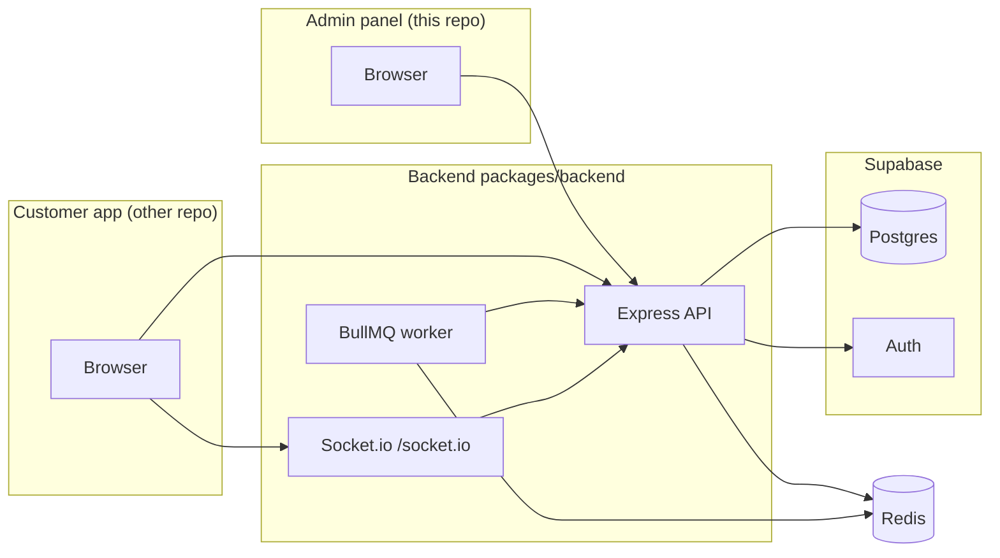

# Product design, user flows, and reference

This document is the **single entry point** for how the platform is meant to work. Use it alongside **OpenAPI** (`http://localhost:3000/api-docs` when the backend is running), ADRs under [`docs/adr/`](./adr/README.md), and [`image-generation-flow.md`](./image-generation-flow.md).

| Audience | How to use this doc |
|----------|----------------------|
| **Developers** | Architecture, flows, where code lives, env and migration pointers. |
| **Admin users** | What the admin app is for, sidebar areas, and what is *not* in this repo. |
| **Customer app builders** | Contract summary for `/api/customer/*`; customer UI lives in another repository. |
| **AI assistants** | Read this file first; follow links for depth; do not invent features not described here. |

---

## 1. What this product is

**AI Post Management** is a platform for **campaign-driven AI image generation**: configurable campaigns (style, mood, aspect ratio, optional **custom sections**, short **`basePrompt`**). **Admin-managed** templates and campaign options; **customer-facing** generation and assets in **Supabase** (Postgres + Auth).

**In this monorepo:**

| Piece | Role |
|--------|------|
| **`packages/backend`** | Shared **Express** API: admin routes, customer routes, Stripe, email, Swagger, async image queue (**BullMQ** + **Redis**), **Socket.io** for generation events. |
| **`packages/frontend`** | **Admin panel only** (React + Vite + Ant Design + Redux + TanStack Query). |

**Outside this monorepo:** the **customer / studio** web app (login, dashboard, generate UI, etc.) is maintained **separately** but calls the same backend (`VITE_API_URL` / equivalent).

---

## 2. Actors and authentication

| Actor | Role in Supabase `profiles` | Typical surface |
|--------|------------------------------|-----------------|
| **Admin** | `role = admin` | Admin panel in this repo; uses admin APIs + some customer APIs for preview where allowed. |
| **Customer** | `role = customer` | Separate customer app; uses **`/api/customer/*`** with **Supabase access JWT** (`Authorization: Bearer …`). |

All protected HTTP APIs expect the **Supabase JWT**. The backend verifies the token with Supabase and attaches `req.user`.

---

## 3. High-level system view

- **Synchronous** image generation returns **201** + asset when **`REDIS_URL`** is unset (or async forced off).
- **Asynchronous** path: **202** + `jobId`, worker on Redis, completion via **Socket.io** and/or **GET** poll (see §6).

---

## 4. Admin user flow (this repo)

After login (`/login`), the sidebar drives primary work:

| Route | Label | Purpose |
|--------|--------|---------|
| `/dashboard` | Dashboard | Overview / stats for the admin experience. |
| `/clients` | Clients | Manage **customer** accounts (create/edit); link to per-customer **prompts**. |
| `/clients/:customerId/prompts` | (via Clients) | **Prompt management** for a customer (admin tooling). |
| `/campaigns` | Prebuilt Campaigns | CRUD **platform prebuilt** campaigns (`is_prebuilt`), used as templates customers can clone. |
| `/campaign-options` | Campaign Options | Admin configuration of **campaign option groups** (e.g. styles, moods) for the builder. |
| `/image-generation` | Image generation | **DB-driven image backend**: active provider, **encrypted** provider API keys, **per-provider model IDs** (`provider_models`). |

**Swagger:** admin JWT → tag **Image Generation (Admin)** and other admin tags at **`/api-docs`**.

---

## 5. Customer user flow (contract only; UI elsewhere)

Customers authenticate with Supabase; the app sends **`Authorization: Bearer <access_token>`** to the backend.

Typical sequence:

1. **Profile / dashboard** — `GET /api/customer/profile`, `GET /api/customer/dashboard`.
2. **Browse options** — `GET /api/customer/campaign-options` for UI dropdowns.
3. **Campaigns** — list/read/create/update/delete **own** campaigns; read **prebuilt** templates; **clone** prebuilt to own workspace (`POST /api/customer/campaigns/:id/clone`).
4. **Generate image** — `POST /api/customer/generate` with body fields such as `campaignId`, `basePrompt`, `aspectRatio`, `name`, etc. (see Swagger **Customer API → Generate an image**).
5. **Assets** — `GET /api/customer/assets`, `GET /api/customer/assets/:id`, patch name/like.

**Async generation (when Redis is enabled):**

- Response **202** + `{ jobId, status }`.
- **Socket.io** URL same host, path **`/socket.io`**, JWT via **`auth.token`** and/or **`Authorization: Bearer`** on the handshake (see [`image-generation-flow.md`](./image-generation-flow.md)).
- **Important:** connect the socket **before** (or immediately when) firing generate if you need the push; late joiners do not receive past events.
- **Poll:** `GET /api/customer/generation-jobs/:jobId` returns `pending` | `processing` | `completed` | `failed` and the **asset** when done.

**Viewing generated images:** `image_url` on **`generated_images`** (HTTPS URL or `data:` URL from some providers). Use **assets** API or Supabase Table Editor.

---

## 6. Image generation (product behavior)

- **Prompt assembly:** platform system block (`image_gen_platform_system`) + user/campaign prompt (documented in Swagger and [`image-generation-flow.md`](./image-generation-flow.md)).
- **Provider selection:** `image_generation_settings.active_provider` + encrypted keys in **`image_provider_credentials`**; optional **`provider_models`** JSON (migration **017**). See [ADR 0002](./adr/0002-image-providers-encrypted-credentials.md).
- **Legacy override:** if `IMAGE_GENERATION_USE_EXTERNAL=true` and gateway URL/key are set, that path can take precedence (see `.env.example` and services).
- **Async transport:** [ADR 0001](./adr/0001-async-image-generation-websocket.md) + [`image-generation-flow.md`](./image-generation-flow.md).

**Developer smoke test (socket before POST):** from `packages/backend`, `ACCESS_TOKEN='<jwt>' npm run socket:smoke` (see `package.json` script).

---

## 7. Key technical references

| Topic | Location |
|--------|----------|
| Env vars (backend) | `packages/backend/.env.example` |
| DB migrations | `packages/backend/supabase/migrations/` |
| OpenAPI / Swagger | `packages/backend/src/config/swagger/`; serve **`/api-docs`** |
| Customer routes | `packages/backend/src/routes/customerApiRoutes.js` |
| Admin routes | `packages/backend/src/routes/` (multiple files mounted in `app.js`) |
| Image provider runtime | `packages/backend/src/services/imageProviderRuntime.js` |
| Socket auth | `packages/backend/src/socket/socketServer.js` (`extractJwtFromSocketHandshake`) |
| Async worker | `packages/backend/src/queues/imageGenerationQueue.js` |

---

## 8. Local development defaults

| Service | Default URL |
|---------|----------------|
| Backend API | `http://localhost:3000` |
| Swagger UI | `http://localhost:3000/api-docs` |
| Admin panel | `http://localhost:5173` (or next free port if busy) |
| Socket.io | Same host as API, path **`/socket.io`** |

Root **`npm run dev`** may start **both** backend and admin; use workspace scripts to run one at a time if needed.

---

## 9. For AI and documentation maintenance

- **Treat this file + ADRs + Swagger as source of truth** for behavior; implementation details live in code.
- **Do not assume** the customer UI exists in this repo; reference **Customer API** only.
- When changing async or provider behavior, update **`image-generation-flow.md`**, relevant **ADR**, and **Swagger** descriptions in the same change set when possible.

---

## 10. Related documents

| Document | Content |
|----------|---------|
| [README.md](../README.md) | Monorepo layout, quick start, scripts. |
| [E2E_CAMPAIGN_TO_IMAGE.md](./E2E_CAMPAIGN_TO_IMAGE.md) | QA: campaign-options → campaign → generate; scenario CSV. |
| [image-generation-flow.md](./image-generation-flow.md) | Image UX, prompt order, async + Socket + poll. |
| [adr/README.md](./adr/README.md) | Index of architecture decision records. |
