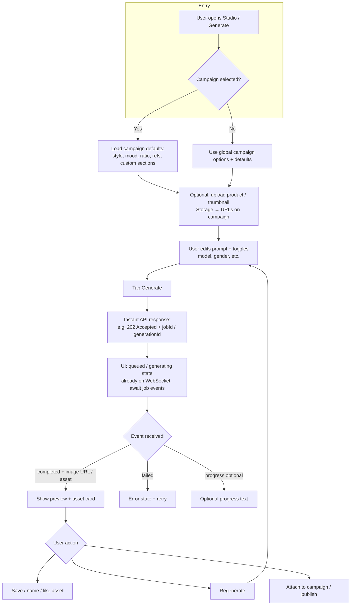
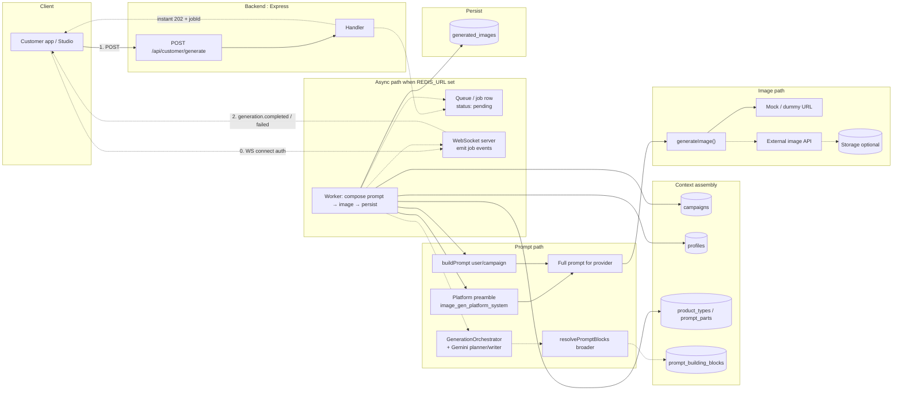
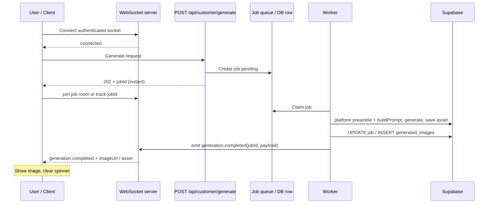

# Image generation: architecture and UX flow

This document describes the **target** customer experience (including async delivery) and how it maps to backend pieces today vs planned. For the wider product picture (admin vs customer apps, roles, doc index), see **[`PRODUCT_AND_FLOWS.md`](./PRODUCT_AND_FLOWS.md)**.

**Formal decision:** [ADR 0001 — Async image generation with WebSocket delivery](./adr/0001-async-image-generation-websocket.md). OpenAPI (Swagger) summarizes the HTTP contract and illustrative WebSocket payload shapes under **Customer API → Generate an image**.

**Backend wiring:** Set **`REDIS_URL`** to enable **202 + BullMQ + Socket.io** (path **`/socket.io`**). Authenticate the socket with the same Supabase access JWT as REST: `auth: { token: '…' }`, or **`Authorization: Bearer …`** on the handshake (e.g. Postman), or query `token` / `access_token`. **Important:** connect the socket **before** (or right when) you call `POST /generate` — completed jobs are not replayed to late joiners. **Poll:** `GET /api/customer/generation-jobs/:jobId` returns status and the **asset** when `completed`. Without Redis, the API keeps **201** synchronous generation for simpler local dev.

---

## Platform system prompt (implemented)

All customer image generations use a **shared platform preamble** prepended to the user/campaign prompt before the model runs:

| Source | Purpose |
|--------|---------|
| **`prompt_building_blocks`** | Global row `block_key = image_gen_platform_system`, `category = system`, `product_type_id` NULL (seeded in migration `015_seed_platform_image_system_block.sql`). Editable in **Admin → Prompt blocks**. |
| **Scoped override** | Same `block_key` with a non-null `product_type_id` wins when the campaign has `product_type_id` (uses existing `resolvePromptBlocks` merge). |
| **`IMAGE_GENERATION_SYSTEM_PROMPT`** | Env fallback if the DB row is missing or empty (e.g. fresh dev DB). |

The string stored on **`generated_images.prompt_used`** is the **full** prompt sent to the provider (preamble + user-facing `buildPrompt()` output). See Swagger **Customer API → Generate an image** for the ordered assembly list.

---

## Image providers (implemented)

| Piece | Role |
|--------|------|
| **`image_generation_settings`** | Singleton row (`id = default`): **`active_provider`** = `mock` \| `openai` \| `google` \| `grok` \| `external_http`. Migration `016`. |
| **`image_provider_credentials`** | One row per provider (`openai`, `google`, `grok`): **AES-256-GCM** ciphertext + **per-row IV and auth tag**. Master key: env **`PROVIDER_KEYS_MASTER_KEY`**. |
| **Admin API** | `GET/PUT /admin/image-generation/settings`, `GET/PUT/DELETE /admin/image-generation/credentials/:provider` (Swagger tag **Image Generation (Admin)** at `/api-docs`). |
| **Admin UI** | Frontend route **`/image-generation`** (sidebar **Image generation**) on the admin panel (`packages/frontend`). |
| **Runtime** | `imageProviderRuntime` reads active provider (cached), decrypts key when needed, calls adapter. **OpenAI:** `/v1/images/generations`. **Google:** Imagen `:predict` on `generativelanguage.googleapis.com` (returns base64 → stored as **data URL** on `generated_images.image_url`). **Grok:** `POST /v1/images/generations` on `api.x.ai` (temporary HTTPS URL or base64). |
| **Legacy** | If **`IMAGE_GENERATION_USE_EXTERNAL=true`** and **`IMAGE_GENERATION_API_URL`** are set, that HTTP gateway **overrides** DB routing (unchanged for existing deployments). |

### Choosing a provider for MVP (product guidance)

1. **Start with OpenAI** (`dall-e-3` or `gpt-image-1`): mature API, predictable aspect sizes, widely documented, and easiest to debug for a first shipped experience.
2. **Add Google Imagen** when you want Google’s stack, SynthID watermarking, and strong marketing / photoreal prompts — use the same **Google AI (Gemini) API key** as other Gemini features.
3. **Add Grok** for xAI’s Imagine pipeline (OpenAI-shaped client, aspect ratio + resolution knobs). URLs are **short-lived**; treat like OpenAI-hosted URLs (consider copying to your own storage later if links expire).

**Other providers** (Stability AI, Replicate, Bedrock, etc.) are not wired as native `active_provider` values yet; use **`external_http`** with a small gateway, or extend `016`’s provider enum + credentials in a new migration.

Related ADR: [0002 — Image providers and encrypted credentials](./adr/0002-image-providers-encrypted-credentials.md).

---

## User experience flow

Image generation can take several seconds or longer. The API should **acknowledge the request immediately**; the client **shows progress** and **renders the image when it is ready**, pushed over the **app WebSocket** (not blocking on the HTTP response). Supabase stays the source of truth for rows and storage; **delivery to the UI is via WebSocket events** from the Node backend.

### WebSocket delivery (finalized)

**Decision:** use a **WebSocket connection** from the customer app to the same backend (e.g. Socket.io or `ws` + auth) for generation lifecycle events.

- **Connect:** authenticate the socket (session/JWT) so events are scoped to the signed-in user.
- **After `202` + `jobId`:** client either joins a room keyed by `jobId` or filters client-side on `jobId` in each message.
- **Server → client messages** (names are illustrative): e.g. `generation.progress` (optional), `generation.completed` (payload: image URL, `generated_images` id, metadata), `generation.failed` (code, message).
- **Persistence:** worker still writes `generated_images` (and optional job row) in Supabase; the WebSocket layer is for **low-latency UI updates**, not replacing the database.

Supabase Realtime / Firebase are **out of scope** for this path unless you add them later for other features (e.g. admin dashboards or push notifications).

**Planned UX additions (unchanged)**

- Before **Generate**, the app may surface **missing required inputs** (e.g. product image) if a planner/agent requires them for this mode.
- **Generate** still feels like one tap; planning + prompt assembly run **server-side** after the instant accept.

---

## Architectural flow (current + planned)

Solid lines ≈ **implemented today**. Dashed ≈ **planned**: full agent orchestration beyond the platform preamble.

**Today:** With Redis, **accept** is fast (**202**) and the worker composes **platform preamble + `buildPrompt()`**, then **generateImage → saveGeneratedImage**, then **WebSocket** notify. Without Redis, the same composition runs inline and returns **201**. The platform preamble does **not** require `product_type_id` on campaigns; optional overrides use the same `block_key` when you add per-type rows later.

---

## Sequence (target async)

